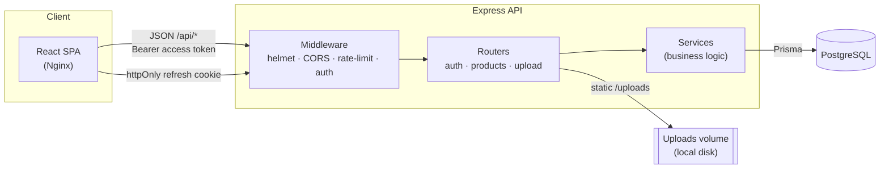
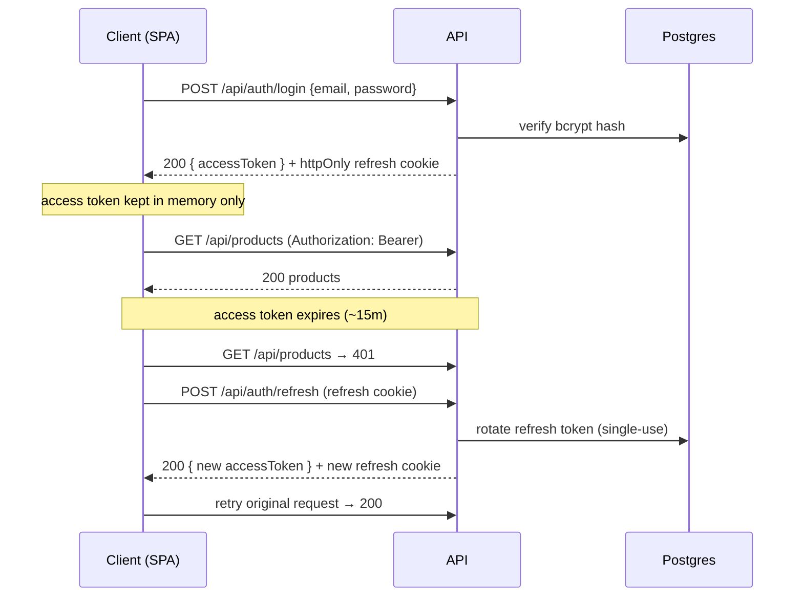

# Product Store — REST API + Web Client

A RESTful API for managing an online store's products, plus a React web client
that consumes it. Built for the FullStack Developer Test Assignment.

**Live demo:** <https://mobupps.mohamedameen.in/>
· **Swagger UI:** <https://mobupps.mohamedameen.in/docs/>
· **Repo:** <https://github.com/mohamedameen21/mobuups>

> **Demo login** (seeded): `demouser@gmail.com` / `password`
> Product browsing requires authentication, so log in (or register) first.

---

## Contents

- [Features](#features)
- [Tech stack](#tech-stack)
- [Architecture](#architecture)
- [Repository layout](#repository-layout)
- [Quick start — one-click Docker](#quick-start--one-click-docker)
- [Local development setup](#local-development-setup)
- [Production setup](#production-setup)
- [Environment variables](#environment-variables)
- [API overview](#api-overview)
- [Testing](#testing)
- [Design document](#design-document)

---

## Features

- Product **CRUD** with search, category filter, sorting, and pagination.
- **JWT authentication** — short-lived access token + rotating, DB-stored
  refresh token in an httpOnly cookie.
- Every product action (view / add / edit / delete) requires a valid access token.
- Image upload endpoint (raster images only, 5 MB cap).
- React SPA: paginated grid, debounced search, category filter, auth-guarded
  create/edit/delete, and loading / error / empty states.
- Hardening: `helmet` security headers, auth-endpoint rate limiting, strict
  SameSite cookies, bcrypt password hashing.
- OpenAPI/Swagger docs, a Postman collection, and a one-command Docker setup.

## Tech stack

| Layer     | Technology                                                           |
|-----------|----------------------------------------------------------------------|
| Backend   | Node.js, Express 5, TypeScript (ESM, strict), Zod                     |
| Database  | PostgreSQL via Prisma 7 (driver-adapter, `@prisma/adapter-pg`)        |
| Auth      | `jsonwebtoken` (access) + opaque DB refresh token, `bcrypt`          |
| Frontend  | React 19, Vite, TanStack Query, React Router, shadcn/ui, Axios       |
| Tests     | Vitest + Supertest (backend), Vitest + Testing Library (frontend)    |
| Delivery  | Docker Compose (Postgres + API + Nginx SPA), Swagger UI, Postman     |

## Architecture



Request lifecycle inside the API: **route → auth middleware → controller
(validate with Zod) → service (Prisma) → standard JSON envelope**. A global
error handler turns every thrown error into a consistent `{ success, data, meta,
error }` shape.

### Authentication flow



## Repository layout

```
mobupps/
├── backend/            Express + Prisma API (see backend/src/modules/*)
├── frontend/           React + Vite SPA
├── docker-compose.yml  Postgres + API + Nginx-served SPA
├── docker-up.sh        one-click launcher (auto host UID/GID + .env)
├── .env.example        root env for Docker Compose
├── swagger.json        OpenAPI 3 spec
├── postman_collection.json
├── DESIGN.md           design document
└── README.md
```

## Quick start — one-click Docker

Requires Docker + Docker Compose. From the repo root:

```bash
./docker-up.sh
```

The script auto-detects your host UID/GID (so the uploads volume stays
writable), creates a root `.env` from `.env.example` if missing, then runs
`docker compose up --build`. It brings up three containers: **Postgres**, the
**API** (which runs migrations and seeds ~200 demo products on start), and the
**Nginx-served SPA**.

When it finishes, open the frontend at `http://localhost:8080` (override with
`FRONTEND_PORT` in `.env`) and log in with the demo credentials above.

Any extra args pass straight through to Compose:

```bash
./docker-up.sh -d                  # detached
./docker-up.sh --no-cache          # force a clean rebuild
```

Plain Compose works too, if you'd rather set UID/GID yourself:

```bash
docker compose up --build
```

## Local development setup

Run the two apps directly (Node 20+ and a local PostgreSQL required).

**1. Backend**

```bash
cd backend
cp .env.example .env          # then set DATABASE_URL and JWT_ACCESS_SECRET
npm install
npm run db:fresh              # migrate + seed (~200 products, demo user)
npm run dev                   # API on http://localhost:4000
```

**2. Frontend** (in a second terminal)

```bash
cd frontend
cp .env.example .env          # VITE_API_URL — default /api works behind a proxy;
                              # for standalone dev set VITE_API_URL=http://localhost:4000/api
npm install
npm run dev                   # SPA on http://localhost:5173
```

> Generate a real secret with `openssl rand -base64 32` and put it in
> `JWT_ACCESS_SECRET`. The API refuses to boot if `DATABASE_URL` or
> `JWT_ACCESS_SECRET` is missing.

## Production setup

The included Docker setup is production-shaped and is what runs the live demo
(behind a Coolify/Nginx reverse proxy):

- The **API container** is internal-only (`expose`, not `ports`) — all public
  traffic enters through the frontend's Nginx, which proxies `/api/*` to the
  backend over the Docker network. This keeps the API off the public internet.
- On start the API runs `prisma migrate deploy` (not `dev`) via
  `backend/docker-entrypoint.sh`, then seeds if empty.
- Uploaded images persist on a named Docker volume (`uploads_data`).
- For a real deployment, set strong values in the root `.env`: a unique
  `JWT_ACCESS_SECRET`, `NODE_ENV=production` (enables `Secure` cookies), and
  `CORS_ORIGIN` set to your public frontend origin.

```bash
# on the server
cp .env.example .env          # edit secrets + CORS_ORIGIN + ports
docker compose up --build -d
```

## Environment variables

**Root `.env`** (Docker Compose):

| Variable            | Purpose                                          |
|---------------------|--------------------------------------------------|
| `PUID` / `PGID`     | Host user/group mapping for volume permissions   |
| `FRONTEND_PORT`     | Published SPA port (default `8080`)              |
| `BACKEND_PORT`      | API port inside the network (default `4000`)     |
| `DB_PORT`           | Published Postgres port (default `5432`)         |
| `POSTGRES_*`        | DB name / user / password                        |
| `NODE_ENV`          | `production` enables `Secure` cookies            |
| `JWT_ACCESS_SECRET` | Signing secret for access tokens — **change it** |
| `CORS_ORIGIN`       | Allowed browser origin for credentialed requests |

**`backend/.env`** (local dev): `DATABASE_URL`, `JWT_ACCESS_SECRET`,
`JWT_ACCESS_EXPIRES` (e.g. `15m`), `CORS_ORIGIN`, `PORT`.

**`frontend/.env`**: `VITE_API_URL` (default `/api`).

## API overview

Base path `/api`. Full interactive reference at `/docs` (Swagger UI); importable
`postman_collection.json` at the repo root.

| Method | Path              | Auth           | Description                            |
|--------|-------------------|----------------|----------------------------------------|
| POST   | `/auth/register`  | —              | Create account                         |
| POST   | `/auth/login`     | —              | Log in                                 |
| POST   | `/auth/refresh`   | refresh cookie | Rotate tokens                          |
| POST   | `/auth/logout`    | refresh cookie | Revoke refresh token                   |
| GET    | `/products`       | access token   | List (search, filter, sort, paginate)  |
| GET    | `/products/:id`   | access token   | Get one product                        |
| POST   | `/products`       | access token   | Create                                 |
| PATCH  | `/products/:id`   | access token   | Update                                 |
| DELETE | `/products/:id`   | access token   | Delete                                 |
| POST   | `/upload`         | access token   | Upload one image (`multipart: image`)  |

Example:

```bash
# log in, capturing the refresh cookie
curl -X POST http://localhost:4000/api/auth/login -c cookies.txt \
  -H 'Content-Type: application/json' \
  -d '{"email":"demouser@gmail.com","password":"password"}'

# list products (use the accessToken from the login response)
curl 'http://localhost:4000/api/products?search=pizza&page=1&limit=12' \
  -H "Authorization: Bearer $ACCESS_TOKEN"
```

## Testing

Both sides ship automated tests plus strict type-checking and linting.

```bash
# backend
cd backend && npm test          # Vitest + Supertest (routes, services, middleware)
npm run typecheck               # strict tsc --noEmit

# frontend
cd frontend && npm test         # Vitest + Testing Library (components, pages, hooks)
npm run typecheck
```

## Design document

See [`DESIGN.md`](./DESIGN.md) for the full design write-up: endpoints,
authentication mechanism, request/response structures, data assumptions and
validations, example scenarios, trade-offs, and testing strategy (with Mermaid
diagrams).
